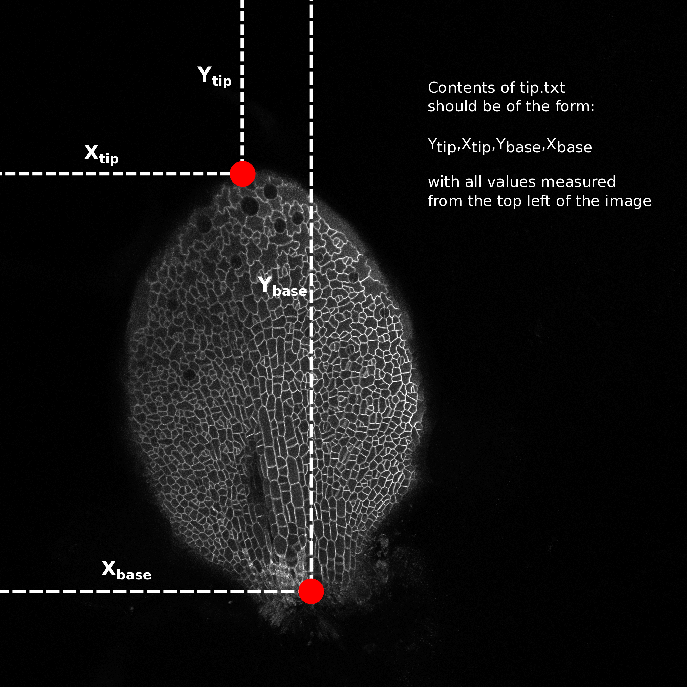

# Leaf Analysis Toolkit

Contains a suite of scripts and source code for extracting quantitive data from confocal images of entire leaves.

## Preparing the .lif files for segmentation
To use the segmentation software, the images first need to be converted from .lif to .png format and then the stacks need to be flattened, reducing the 3d stack to a 2d projection.
The file conversion script automatically converts every stack contained in the .lif file to a separate .png stack. There are a number of methods of projecting 3d stacks to 2d images, here we produce a standard 'max z projection' and what we call a 'Gaussian projection' (Method developed by Matthew Hartley). The Gaussian projection aims to reduce the effects of fluorescence from sub-epidermal layers interfering with the image segmentation. It works by blurring the image in 3d and looking for the z-index with the max signal, this should be the top of the leaf. It creates a surface from this index and then blurs the in the x-y directions. It uses this surface and performs a max projection in a small slice around this, hopefully only catching the upper epidermal surface of the leaf. This image is then used for the next step, image segmentation.

Type the following commands into your terminal application (from the scripts directory):

Steps:

1. Converting .lif to stack:

	`python lif2stack.py example.lif`
	
	creates a separate directory for each stack in the .lif file of the format (hereafter called the experiment directory):
	
	 `proj_[lif_name]_[image number]_[image_name]`
	 
	 i.e., `proj_8DAS_AA_Col.lif_0_Series013`
	 
	 for the 0th image, named 'Series013', from the .lif file named `8DAS_AA_Col.lif`.
	 
	 This directory contains a directory called 'stack' containing the png form of the image stack and a file called 'dims.txt' which contains the image metadata. The 'proj' directory will contain all further output relating to that image.
	
2. Projecting the stack:

	`python stack2proj.py proj_directory`
	
	will create the following images, where [name] is the name of the base image directory:
	
|Image Name                     | Description                                                  |
--------------------------------| --------------------------------------------------------------
| `[name]_max-proj.png`         | the maximum z projection of the image stack                  |
| `[name]_proj-g3d.png`         | the projection around the surface found by 3d gauss blurring |
| `[name]_proj-g3d_rev.png`     | the projection around the surface found by 3d gauss blurring |
| `[name]_proj-pp-clahe-g3d.png`| the post processed version of proj-g3d                       |
| `[name]_surface-g3d.png`      | the surface used for the surface projection                  |

`proj-g3d.png` and `proj-g3d_rev.png` differ in that the first assumes the confocal scan was performed from top to bottom (0th slice at top) and the second assumes the reverse (0th slice at bottom). If you know the scan direction, use that one, otherwise use your eyes to see which one looks best. These will both be segmented in the next step.

## Segmenting the projected images
#### Using SPM
For building the Segmentation Potts Model from source use Excalib (please contact Stan Maree).

To segment the results from the previous step run the following command:

`python segment_from_dir.py [image_directory]`

Where `[image_directory]` is the same directory created in the last step.

This will create two sub-directories `segmented` and `segmented_rev` which will contain the segmentation output and then proceed to segment the two images created in the last step. This could take some time. When segmentation is finished two files, "fwd_seg.png" and "rev_seg.png" will be in the experiment directory.

This step can be completed on the NRP HPC if you have access, although scripts for that aren't provided here, yet.

#### Using watershed with manual seeds
Using watershed requires the generation of a 'manual seeds' file.

## The "tip.txt" file
Open one of the leaf images in a image editing program (I use [GIMP](https://www.gimp.org)) and hover the cursor over the tip of the leaf. Make a note of the pixel coordinates, normally reported as x,y (bottom left of window in GIMP). Do the same for a point in the middle of the base of the leaf (see image).

Make a file named "tip.txt" in the image directory and write the numbers in the following format:

`Y_tip,X_tip,Y_base,X_base`

e.g. `523,765,1043,512`

and save the file. This is needed to calculate the cell centroids relative to the tip and the mid vein (transform from image coordinates to leaf coordinates)

## Extracting the data

## Generating heat maps

## Conclusion

|File/Directory name            | Description                                                  |
--------------------------------| --------------------------------------------------------------
|             |              |

## Other provided scripts
`.\scripts\proj_lib.py` contains functions for projecting stacks, used by other scripts

`.\scripts\projpp_lib.py` contains functions for post-processing projected images, used by other scripts

`.\scripts\common_functions.py` contains common functions, written by Ross, for loading images/data,  performing analysis, plotting, etc. used by other scripts. Not all functions are used at the moment.

# Contacts
In the first instance, Ross Carter (ross.carter@jic.ac.uk / rosscarter33@gmail.com)

For image segmentation and SPM compilation etc., Stan Maree (stan.maree@jic.ac.uk)

For cell tracking, Matthew Hartley (matthew.hartley@jic.ac.uk)