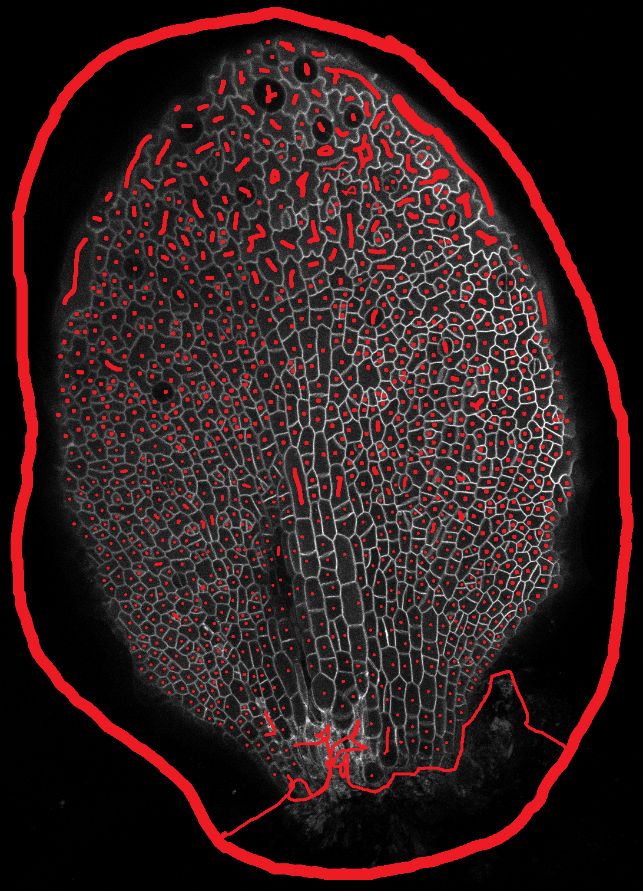
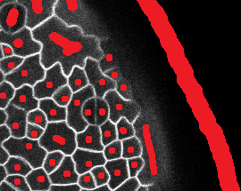
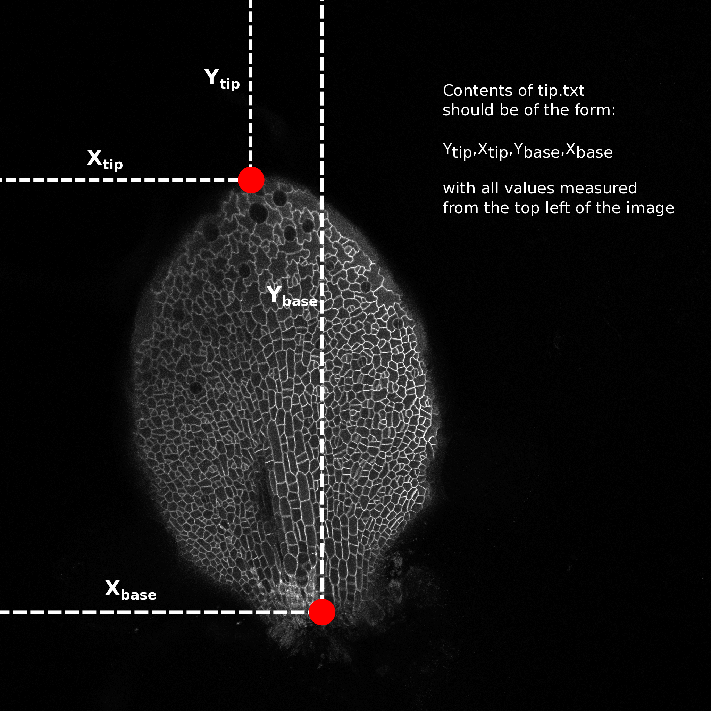

# Leaf Analysis Toolkit

Contains a suite of scripts and source code for extracting quantitive data from confocal images of entire leaves.

## Installation
cloning the git repository should be all you need to do to install.

`git clone https://github.com/rosscarter3/leaf_analysis_toolkit.git`

The image conversion requires the bio-formats command line tools available at:

http://downloads.openmicroscopy.org/bio-formats/5.5.1/

A lot of the python scripts require up-to-date python packages
`pip install -r py_requirements.txt`

## Preparing the .lif files for segmentation
To use the segmentation software, the images first need to be converted from .lif to .png format and then the stacks need to be flattened, reducing the 3d stack to a 2d projection.
The file conversion script automatically converts every stack contained in the .lif file to a separate .png stack. There are a number of methods of projecting 3d stacks to 2d images, here we produce a standard 'max z projection' and what we call a 'Gaussian projection' (Method developed by Matthew Hartley). The Gaussian projection aims to reduce the effects of fluorescence from sub-epidermal layers interfering with the image segmentation. It works by blurring the image in 3d and looking for the z-index with the max signal, this should be the top of the leaf. It creates a surface from this index and then blurs the in the x-y directions. It uses this surface and performs a max projection in a small slice around this, hopefully only catching the upper epidermal surface of the leaf. This image is then used for the next step, image segmentation.

Type the following commands into your terminal application (from the scripts directory):

Steps:

1. Converting .lif to stack:

	`python lif2stack.py example.lif`
	
	creates a separate directory for each stack in the .lif file of the format (hereafter called the experiment directory):
	
	 `proj_[lif_name]_[image number]_[image_name]`
	 
	 i.e., `proj_8DAS_AA_Col.lif_0_Series013`
	 
	 for the 0th image, named 'Series013', from the .lif file named `8DAS_AA_Col.lif`.
	 
	 This directory contains a directory called 'stack' containing the png form of the image stack and a file called 'dims.txt' which contains the image metadata. The 'proj' directory will contain all further output relating to that image.
	
2. Projecting the stack:

	`python stack2proj.py proj_directory`
	
	will create the following images, where [name] is the name of the base image directory:
	
|Image Name                     | Description                                                  |
--------------------------------| --------------------------------------------------------------
| `[name]_max-proj.png`         | the maximum z projection of the image stack                  |
| `[name]_proj-g3d.png`         | the projection around the surface found by 3d gauss blurring |
| `[name]_proj-g3d_rev.png`     | the projection around the surface found by 3d gauss blurring |
| `[name]_proj-pp-clahe-g3d.png`| the post processed version of proj-g3d                       |
| `[name]_surface-g3d.png`      | the surface used for the surface projection                  |

`proj-g3d.png` and `proj-g3d_rev.png` differ in that the first assumes the confocal scan was performed from top to bottom (0th slice at top) and the second assumes the reverse (0th slice at bottom). If you know the scan direction, use that one, otherwise use your eyes to see which one looks best. Delete either `proj-g3d.png` and `proj-g3d_rev.png` depending on which image you wish to use going forward.

## Segmenting the projected images
#### Using SPM
For building the Segmentation Potts Model from source use Excalib (please contact [Stan Maree](mailto:stan.maree@jic.ac.uk)).

To segment the result from the previous step run the following command:

`python spm_segment_from_dir.py [image_directory]`

Where `[image_directory]` is the same directory created in the last step.

This will create a sub-directory `segmented` which will contain the segmentation output and then proceed to segment the two images created in the last step. This could take some time. When segmentation is finished the segmented image will be moved to the image directory.
This step can be completed on the NRP HPC if you have access, although scripts for that aren't provided here, yet.

#### Using watershed with manual seeds
Using watershed requires the generation of a 'manual seeds' file. To create one, duplicate the image you are wishing to segment and make sure the end of the file name is `..._seeds.png` and is in the image directory. Open this image in an image editing program (I use [GIMP](https://www.gimp.org)). Make sure you are editing the picture in RGB mode and pick a non-grey colour. If the cell outline is clear then all that needs to be done is to paint a spot in each cell, being careful not to go over the cell boundaries. Make sure that the background is seeded as well and that all cells that you don't wish to segment are joined to the background seed (large ring in picture). If you have a noisy picture with boundaries from sub epidermal layers make sure you paint over these and fill up as much of the epidermal cell as you can, again without going over the epidermal cell-boundaries.

To watershed segment the projected image using the seeds run the script ws_segment_from_dir.py as follows:

`python ws_segment_from_dir.py [image_directory]`

This will create two images in the image directory `[image_name]ws_seg.png` and `[image_name]colorful.png`. The colourful image overlays the randomly coloured cells on top of the projected image so you can get an idea of the quality of the segmentation. If there are areas where the segmentation isn't working as well as it could, then you can improve the manual seeds image. The seg labels each pixel in the image with an id number (encoded into an RGB value) which corresponds to the cell that pixel belongs to. This image will be used in the next steps.

## The "tip.txt" file
Open one of the leaf images in a image editing program (I use [GIMP](https://www.gimp.org)) and hover the cursor over the tip of the leaf. Make a note of the pixel coordinates, normally reported as x,y (bottom left of window in GIMP). Do the same for a point in the middle of the base of the leaf (see image).

Make a file named "tip.txt" in the image directory and write the numbers in the following format:

`Y_tip,X_tip,Y_base,X_base`

e.g. `523,765,1043,512`

and save the file. This is needed to calculate the cell centroids relative to the tip and the mid vein (transform from image coordinates to leaf coordinates)

## Extracting the data
To extract quantitative data from the segmented image run the script `extract_celldata.py`:

`python extract_celldata.py [image_directory]`

This will generate three files, `data.json`, `data.csv` and `leaf_data.csv`. `data.json` and `data.csv` contain the same data. The `.json` file is for use by other python scripts (for example the heat map script in the next step) and the `.csv` file can be opened in excel.

The properties extracted are all calculated using the python [sci-kit image package](http://scikit-image.org/docs/dev/api/skimage.measure.html#skimage.measure.regionprops). You can edit which properties are extracted by opening `extract_celldata.py` and changing what is stored to the data dictionary. The dictionary key has the form of 'property-name_units' to aid the automatic generation of labelled heat maps in the next step.

## Generating heat maps

To generate heat maps from the extracted data use the script `heatmaps.py`:

`python heatmaps.py [image_directory]`

This will create a subdirectory named `heatmaps` and plot a heat map for each cell-level property extracted in the previous step. Some of these won't be particularly useful, but are generated anyway for debugging/validation reasons.

## Batch Processing
The shell script `./scripts/analyse_all.sh` can be used to batch process an number of images serially.

To run type the following command in the scripts directory:

`sh analyse_all.sh [process] [path to directories]`

Where `[process]` is one of: project, segment, extract or heatmap. Each step depends on the previous and will not run on a directory that does not contain the output from the previous step.

## Updating
To update change directory to `leaf_analysis_toolkit`, for example in the terminal:

`cd ~/tools/leaf_analysis_toolkit`

and pull the latest version from GitHub"

`git pull`

## Conclusion

|File/Directory name            | Description                                                  |
--------------------------------| --------------------------------------------------------------
|`./stack`| contains the converted confocal stack as individual `.tiff` files|
|`*_max-proj.png`| the max projection of the stack, each pixel in the 2d image is the value of the maximum voxel in that column |
|`*_proj-g3d_rev.png` | The 'Gaussian projection' of the confocal stack (see above)|
|`*_surface-g3d.png` | The surface used for the gaussian projection |
|`*_proj-pp-g3d.png` | an attempt at post processing the projected image. **not used** |
|`*_proj-pp-clahe-g3d.png` | another attempt at post processing the projected image. **not used** |
|`*_proj-g3d_rev_manual.png` | The manually created seeded image for watershed/SPM segmentation (see above) |
|`*_proj-g3d_rev.pngws_seg.png` | The segmented image (watershed) |
|`*_proj-g3d_rev.pngcolorful.png` | a representation of the segmented image, used to check quality of segmentation by eye |
|`dims.txt`| The metadata extracted from the raw confocal stacks (pixel dimensions, voxel sizes)|
|`tip.txt`| The location of the tip/petiole of the leaf. (See above)|
|`data.csv`| The cell level data calculated from the segmented image, image metadata and the tips.txt files|
|`leaf_data.csv`| The leaf level data **(may not be correct!, needs some work)**|
|`./heatmaps`| contains all the heatmaps generated by the `heatmaps.py` script |

## Other provided scripts
`.\scripts\proj_lib.py` contains functions for projecting stacks, used by other scripts

`.\scripts\projpp_lib.py` contains functions for post-processing projected images, used by other scripts

`.\scripts\common_functions.py` contains common functions, written by Ross, for loading images/data,  performing analysis, plotting, etc. used by other scripts. Not all functions are used at the moment.

## Example Workflow

# Contacts
In the first instance, Ross Carter (ross.carter@jic.ac.uk / rosscarter33@gmail.com)

For image segmentation and SPM compilation etc., Stan Maree (stan.maree@jic.ac.uk)

For cell tracking, Matthew Hartley (matthew.hartley@jic.ac.uk)
